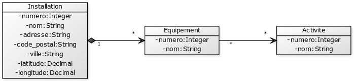
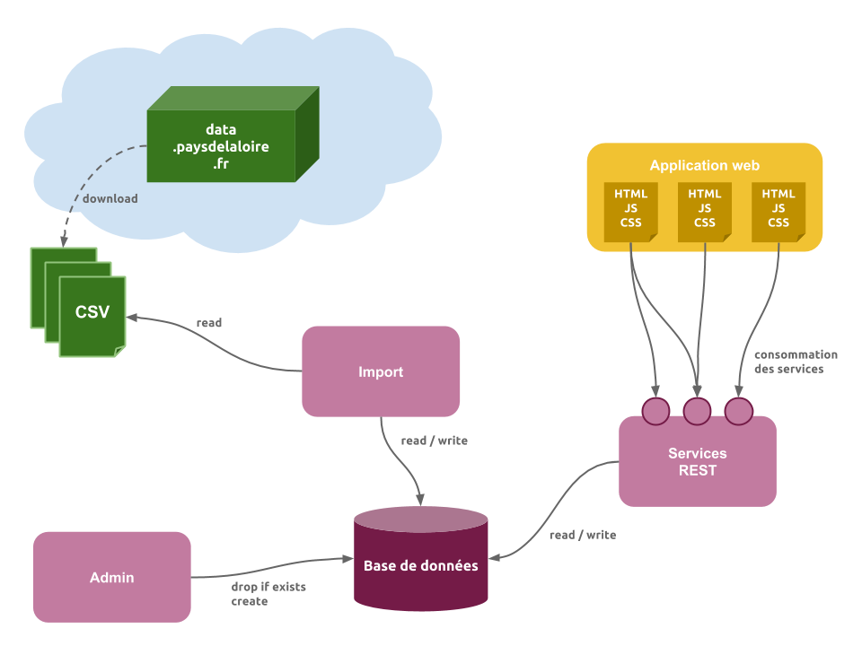

# Installations Sportives des Pays de la Loire

## Prise en main de Python

Le langage de programmation utilisé pour le projet est [Python](https://www.python.org), en version 3.

Si vous souhaitez apprendre les bases du langage, rendez-vous sur le site [Open Classrooms](http://openclassrooms.com/courses/apprenez-a-programmer-en-python) !

### Pré-requis

Vérifier votre version de Python en lançant la commande `python` ou `python3` dans un terminal :

```
$> python3
Python 3.2.3 (default, Jun 18 2015, 21:46:58)
[GCC 4.6.3] on linux2
Type "help", "copyright", "credits" or "license" for more information.
>>>
```

### Exercice

Voici un exercice de prise en main du langage :

> Ecrivez un programme qui demande un nombre à l'utilisateur, qui détermine si le nombre est un nombre premier et qui affiche le résultat.

Quelques conseils :

* Ne mettez pas tout votre code dans un seul fichier.
* Ecrivez des tests unitaires.
* Documentez votre code.
* Gérez les erreurs possibles de votre programme.

#### Une solution possible

Regardez ici : https://gist.github.com/sebprunier/2b1dc6047434b10af8fb

## Le projet

L'objectif est de développer une application manipulants des données relatives aux installations sportives de la région Pays de la Loire.

Les données sont issues de [http://data.paysdelaloire.fr](http://data.paysdelaloire.fr).

Trois jeux de données sont à récupérer, au format CSV :

* [Installations](http://data.paysdelaloire.fr/donnees/detail/equipements-sportifs-espaces-et-sites-de-pratiques-en-pays-de-la-loire-fiches-installations)
* [Equipements](http://data.paysdelaloire.fr/donnees/detail/equipements-sportifs-espaces-et-sites-de-pratiques-en-pays-de-la-loire-fiches-equipements)
* [Activités](http://data.paysdelaloire.fr/donnees/detail/equipements-sportifs-espaces-et-sites-de-pratiques-en-pays-de-la-loire-activites-des-fiches-equ)

Toutes les colonnes des fichiers CSV ne vont pas forcément nous intéresser. N'utilisez que celle que vous trouvez intéressantes ! Par exemple pour les installations, l'adresse et les coordonnées GPS sont des données facilement exploitables (affichage sur une Google Map par exemple).

Des liens existent entre les trois jeux de données :

* une installation possède un ou plusieurs équipements
* une ou plusieurs activités peuvent être pratiquées sur un équipement donné.




### Architecture

L'application est composée de plusieurs composants ayant chacun un rôle bien défini.

* Le composant `Admin` a pour rôle la création des tables de la base de données.
* Le composant `Import` a pour rôle le remplissage des tables de la base de données à partir des fichiers CSV.
* Le composant `Service` a pour rôle d'exposer les fonctionnalités de l'application, au travers de services REST.
* Le composant `Application web` est destinée aux internautes et a pour rôle de proposer les fonctionnalités de l'application au travers de pages web.


